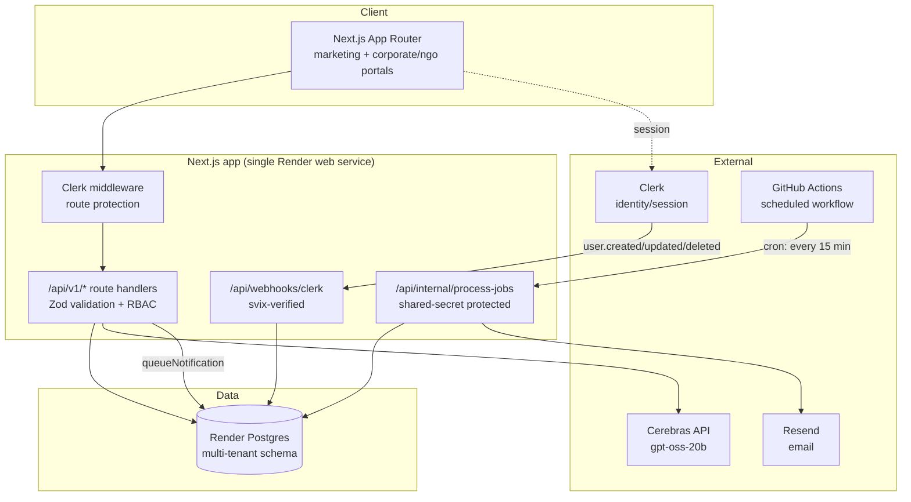
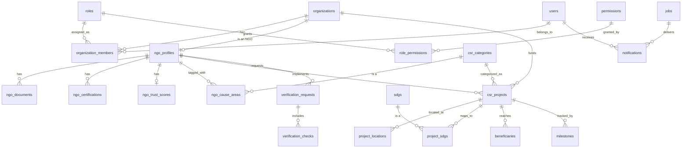

# NITICSR OS — Phase 2 Architecture

Phase 2 builds the enterprise backend foundation Phase 3's Corporate/NGO/Auditor
portals will run on: a multi-tenant Postgres schema, permission-based RBAC,
core NGO/CSR data model, versioned REST APIs, a notification service, and a
DB-backed background job queue.

It deliberately **does not** build several things from the original Phase 2
brief — see [Deferred to roadmap](#deferred-to-roadmap) for why.

## System architecture



## Entity-relationship diagram



## Permission model

Authorization is **permission-based**, not role-hardcoded: call sites check
capabilities like `CSR.Project.Write`, never `if (role === 'admin')`. This
means adding a role or changing what an existing role can do is a data change
(`role_permissions` seed rows), not a code change. See [lib/rbac.ts](../lib/rbac.ts)
and the seed data in
[db/migrations/002_core_org_auth_rbac.sql](../db/migrations/002_core_org_auth_rbac.sql).

Identity is owned by Clerk; the `users` table is a local mirror kept in sync
via the Clerk webhook so we have a stable FK target for ownership and RBAC
joins without depending on Clerk for every query.

## Running migrations

```bash
# DATABASE_URL must point at your Postgres instance
npm run db:migrate
```

Migrations are plain numbered `.sql` files in `db/migrations/`, applied in
order and tracked in a `_migrations` table (see `scripts/migrate.mjs`). No
ORM — the schema is simple enough that hand-written SQL stays readable, and
it avoids a dependency whose query builder would otherwise shape the whole
data layer.

## Adding a new v1 API route

1. Add/extend a Zod schema in `lib/schemas-v1.ts`.
2. Write the route handler under `app/api/v1/...`, wrapped in `withApiErrors`
   (translates Zod/RBAC errors to consistent JSON responses).
3. Call `requirePermission(userId, organizationId, "Some.Permission")` before
   any read/write — this is also what enforces tenant isolation, since the
   underlying query only matches rows for that user *and* that organization.
4. Add the endpoint to `docs/openapi.yaml`.

## Background jobs & notifications

There is no standalone worker process — Render's web service only serves
HTTP. Jobs are rows in a Postgres `jobs` table (see `lib/jobs.ts`), and
`.github/workflows/process-jobs.yml` calls `POST /api/internal/process-jobs`
(protected by `INTERNAL_JOB_SECRET`) on a 15-minute GitHub Actions cron —
free, and no new infrastructure to provision. This is why Redis isn't used
for queuing: at Phase 2 volume, a polling table is simpler and sufficient.

Notifications currently only have a real `email` provider (via Resend,
reused from the Phase 1 contact form). SMS/WhatsApp/push/Slack/Teams/webhook
are modeled in the schema (`notifications.channel`) so the data layer is
ready, but are not wired to a real send path — see the comment in
`lib/notifications.ts`.

## Analytics & consent

`lib/analytics.ts` provides a `trackEvent()` call sites can use today (wired
into the contact form and matchmaking demo submits), plus a consent banner
(`components/site/consent-banner.tsx`) that gates it. No analytics provider
is connected — none has been chosen — so `trackEvent()` is a logged no-op in
development and silent in production. Wiring a real provider (Plausible,
PostHog, GA4) later means editing the one function in `lib/analytics.ts`,
not every call site.

## Deferred to roadmap

These were in the original Phase 2 brief but depend on infrastructure or
partnerships that don't exist yet in this project. Building them now would
mean elaborate mocks standing in for things with no real backing — exactly
the kind of half-finished implementation worth avoiding. They're documented
here as the intended extension points, not abandoned:

- **Escrow engine** — needs a real payment processor / banking partner.
  `csr_projects`/`milestones` already model the project structure an escrow
  ledger would hang off of.
- **Zero-Trust Audit Engine** (GPS validation, EXIF, device attestation,
  camera lock, offline sync) — fundamentally needs a mobile app capturing
  that data at the point of audit. No mobile app exists in this project yet.
- **Real verification integrations** (MCA21, DARPAN, Income Tax, GST, FCRA)
  — none of these expose public self-serve APIs; real integration needs a
  data-sharing agreement or compliant verification vendor.
  `verification_checks` already models the interface (`provider`, `status`,
  `result`, `expires_at`) a real integration would fill in.
- **PostGIS geospatial queries** (polygon search, heatmaps) — plain-Haversine
  radius search over `latitude`/`longitude` is now real (`csr_projects` and
  `ngo_profiles` both support `lat`/`lng`/`radiusKm`); a PostGIS `geometry`
  column is only worth adding once polygon queries or heatmap aggregation
  are actually needed.
- **pgvector semantic search / embeddings / AI risk scoring** — needs real
  usage data to be meaningful; premature before there's a corpus to embed.
- **Redis-backed caching** — not provisioned; revisit if the Postgres-backed
  approach actually becomes a bottleneck.
- **Full event bus** (pub/sub across services) — there's one Next.js app
  today, not multiple services that need decoupling. `audit_logs` and the
  `jobs` table cover the append-only trail and async-processing needs that
  exist right now.

## Phase 4: real workspaces, not just dashboards

Corporate, NGO, and Auditor workspaces (`app/(corporate)`, `app/(ngo)`,
`app/(auditor)`) are wired to live `/api/v1` data — not placeholder KPI
tiles. `components/dashboard/org-context.tsx` resolves (or creates) the
signed-in user's organization of the workspace's type and provides it via
context, so every page underneath just calls `useOrg()` rather than
re-implementing onboarding. `components/dashboard/copilot-panel.tsx` exposes
a real Cerebras-backed AI Copilot (`/api/copilot`) grounded only in the
caller's own organization's records — no cross-tenant data ever enters the
prompt, and the model is instructed to say so rather than guess when the
data doesn't answer the question.

The original Phase 4 brief asked for a much larger surface — a full
"Enterprise Digital Operating Layer" with Executive Command Center, Board/
ESG/Finance/Legal/Consultant/Government workspaces, a configurable workflow
engine, and an offline-capable auditor mobile PWA with device attestation.
That's deferred for the same reason as the Phase 2 items above — building
shallow versions of all of it now would mean UI with no real data or
workflow logic behind it:

- **Government/Board/ESG/Finance/Legal/Consultant workspaces as separate
  surfaces** — the underlying data (SDG mapping, CSR categories, verification
  status) already exists and is queryable via `/api/v1`; these are read-only
  views over the same tables, best built once there's a specific stakeholder
  asking for one, not speculatively.
- **Offline auditor PWA** (GPS geofencing, camera-only capture, perceptual
  hash duplicate detection, offline sync) — same blocker as the Zero-Trust
  Audit Engine above: needs a real mobile app / service-worker + camera
  pipeline that doesn't exist yet. The Auditor Workspace built here is a
  real, functional desktop review queue instead.
- **Configurable workflow engine** (conditional routing, SLA timers,
  escalation chains) — legitimate as its own subsystem once there are enough
  distinct approval flows to justify generalizing beyond the direct
  `status` transitions already implemented on `csr_projects` and
  `verification_requests`.
- **MFA, ABAC, distributed tracing, secrets management** — MFA is a Clerk
  dashboard toggle away when wanted; ABAC/tracing/secrets-management each
  need a tooling decision (which APM? which secrets manager?) not made yet,
  and are premature before there's a security team or real user volume.
- **Command palette, Gantt/Kanban/calendar views** — no concrete page needs
  them yet; see `docs/DESIGN_SYSTEM.md`.

## Phase 5: production readiness — what's real vs. what's certified

The original Phase 5 brief asked for a full enterprise certification
program: load testing at up to 10,000 concurrent users, adversarial
zero-trust penetration testing, mutation testing, blue-green/canary
deploys, and E2E journeys for features (KYC, escrow release, OCR, PDF
board-pack export) that don't exist. That's a QA/SRE/security team's
ongoing program against live infrastructure, not something buildable in a
session — see ADR 0005 for the general policy this follows.

What shipped instead, real and verified:

- **Security**: a code-level review of every API route (`docs/SECURITY.md`)
  — not a formal pentest, but real findings (missing rate limiting on two
  paid, unauthenticated AI endpoints; a non-constant-time secret comparison)
  with real fixes (`lib/rate-limit.ts`, `crypto.timingSafeEqual`).
- **Testing**: `lib/rate-limit.test.ts`, `lib/api-utils.test.ts`, and
  `lib/geo-search.test.ts` (a real integration test against Postgres
  verifying the Haversine radius search actually includes/excludes/orders
  correctly) — measured coverage additions, not a claimed percentage.
- **CI**: `npm audit --audit-level=critical` now runs on every push
  (blocks only on critical severity — see the policy note in `ci.yml` for
  why high/moderate transitive advisories in Next's own dependency tree
  aren't currently blocking).
- **Performance & accessibility**: a real Lighthouse run against the
  production build, documented in `docs/PERFORMANCE.md` with actual scores
  (not asserted targets) — this caught and fixed a genuine accessibility
  bug (unlabeled `Select` triggers, invisible to screen readers) that
  automated CI couldn't have caught on its own.
- **AI governance**: explicit "AI-generated, not verified" labeling on
  both AI surfaces (Copilot, matchmaking demo), model-version logging into
  the existing `audit_logs` table for every Copilot answer.
- **Documentation**: `docs/DEPLOYMENT.md`, `docs/RUNBOOK.md`, and
  `docs/adr/` (5 ADRs covering the real architectural decisions made across
  every phase) — accurate because they describe decisions actually made,
  not a template filled in speculatively.

Deferred, same reasoning as every phase above: load/scale testing (needs a
live staging environment and a reason to spend money simulating traffic
that doesn't exist yet), adversarial zero-trust mobile testing (no mobile
app to attack), mutation testing (marginal value at this codebase's size),
blue-green/canary deploys and Redis/CDN/autoscaling validation (Render's
tier and current traffic don't call for it yet), and a formal OWASP
penetration test (needs a scoped external engagement, not a code review).
