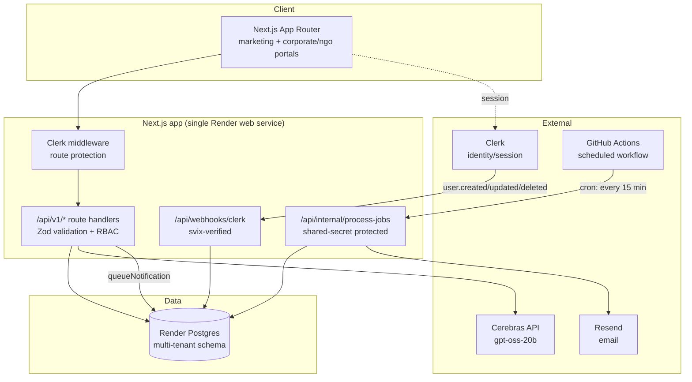
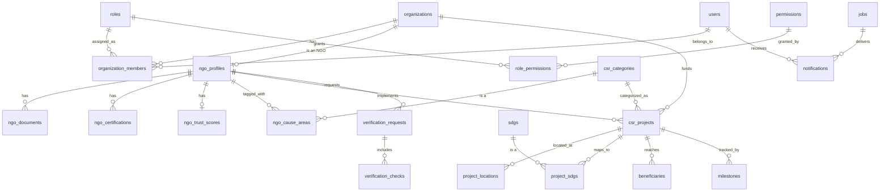

# NITICSR OS — Phase 2 Architecture

Phase 2 builds the enterprise backend foundation Phase 3's Corporate/NGO/Auditor
portals will run on: a multi-tenant Postgres schema, permission-based RBAC,
core NGO/CSR data model, versioned REST APIs, a notification service, and a
DB-backed background job queue.

It deliberately **does not** build several things from the original Phase 2
brief — see [Deferred to roadmap](#deferred-to-roadmap) for why.

## System architecture



## Entity-relationship diagram



## Permission model

Authorization is **permission-based**, not role-hardcoded: call sites check
capabilities like `CSR.Project.Write`, never `if (role === 'admin')`. This
means adding a role or changing what an existing role can do is a data change
(`role_permissions` seed rows), not a code change. See [lib/rbac.ts](../lib/rbac.ts)
and the seed data in
[db/migrations/002_core_org_auth_rbac.sql](../db/migrations/002_core_org_auth_rbac.sql).

Identity is owned by Clerk; the `users` table is a local mirror kept in sync
via the Clerk webhook so we have a stable FK target for ownership and RBAC
joins without depending on Clerk for every query.

## Running migrations

```bash
# DATABASE_URL must point at your Postgres instance
npm run db:migrate
```

Migrations are plain numbered `.sql` files in `db/migrations/`, applied in
order and tracked in a `_migrations` table (see `scripts/migrate.mjs`). No
ORM — the schema is simple enough that hand-written SQL stays readable, and
it avoids a dependency whose query builder would otherwise shape the whole
data layer.

## Adding a new v1 API route

1. Add/extend a Zod schema in `lib/schemas-v1.ts`.
2. Write the route handler under `app/api/v1/...`, wrapped in `withApiErrors`
   (translates Zod/RBAC errors to consistent JSON responses).
3. Call `requirePermission(userId, organizationId, "Some.Permission")` before
   any read/write — this is also what enforces tenant isolation, since the
   underlying query only matches rows for that user *and* that organization.
4. Add the endpoint to `docs/openapi.yaml`.

## Background jobs & notifications

There is no standalone worker process — Render's web service only serves
HTTP. Jobs are rows in a Postgres `jobs` table (see `lib/jobs.ts`), and
`.github/workflows/process-jobs.yml` calls `POST /api/internal/process-jobs`
(protected by `INTERNAL_JOB_SECRET`) on a 15-minute GitHub Actions cron —
free, and no new infrastructure to provision. This is why Redis isn't used
for queuing: at Phase 2 volume, a polling table is simpler and sufficient.

Notifications currently only have a real `email` provider (via Resend,
reused from the Phase 1 contact form). SMS/WhatsApp/push/Slack/Teams/webhook
are modeled in the schema (`notifications.channel`) so the data layer is
ready, but are not wired to a real send path — see the comment in
`lib/notifications.ts`.

## Analytics & consent

`lib/analytics.ts` provides a `trackEvent()` call sites can use today (wired
into the contact form and matchmaking demo submits), plus a consent banner
(`components/site/consent-banner.tsx`) that gates it. No analytics provider
is connected — none has been chosen — so `trackEvent()` is a logged no-op in
development and silent in production. Wiring a real provider (Plausible,
PostHog, GA4) later means editing the one function in `lib/analytics.ts`,
not every call site.

## Deferred to roadmap

These were in the original Phase 2 brief but depend on infrastructure or
partnerships that don't exist yet in this project. Building them now would
mean elaborate mocks standing in for things with no real backing — exactly
the kind of half-finished implementation worth avoiding. They're documented
here as the intended extension points, not abandoned:

- **Escrow engine** — needs a real payment processor / banking partner.
  `csr_projects`/`milestones` already model the project structure an escrow
  ledger would hang off of.
- **Zero-Trust Audit Engine** (GPS validation, EXIF, device attestation,
  camera lock, offline sync) — fundamentally needs a mobile app capturing
  that data at the point of audit. No mobile app exists in this project yet.
- **Real verification integrations** (MCA21, DARPAN, Income Tax, GST, FCRA)
  — none of these expose public self-serve APIs; real integration needs a
  data-sharing agreement or compliant verification vendor.
  `verification_checks` already models the interface (`provider`, `status`,
  `result`, `expires_at`) a real integration would fill in.
- **PostGIS geospatial queries** (radius/polygon search, heatmaps, nearest-NGO)
  — `project_locations` stores plain `latitude`/`longitude` today; adding a
  PostGIS `geometry` column and the `postgis` extension is a small additive
  migration once geo queries are actually needed.
- **pgvector semantic search / embeddings / AI risk scoring** — needs real
  usage data to be meaningful; premature before there's a corpus to embed.
- **Redis-backed caching** — not provisioned; revisit if the Postgres-backed
  approach actually becomes a bottleneck.
- **Full event bus** (pub/sub across services) — there's one Next.js app
  today, not multiple services that need decoupling. `audit_logs` and the
  `jobs` table cover the append-only trail and async-processing needs that
  exist right now.
